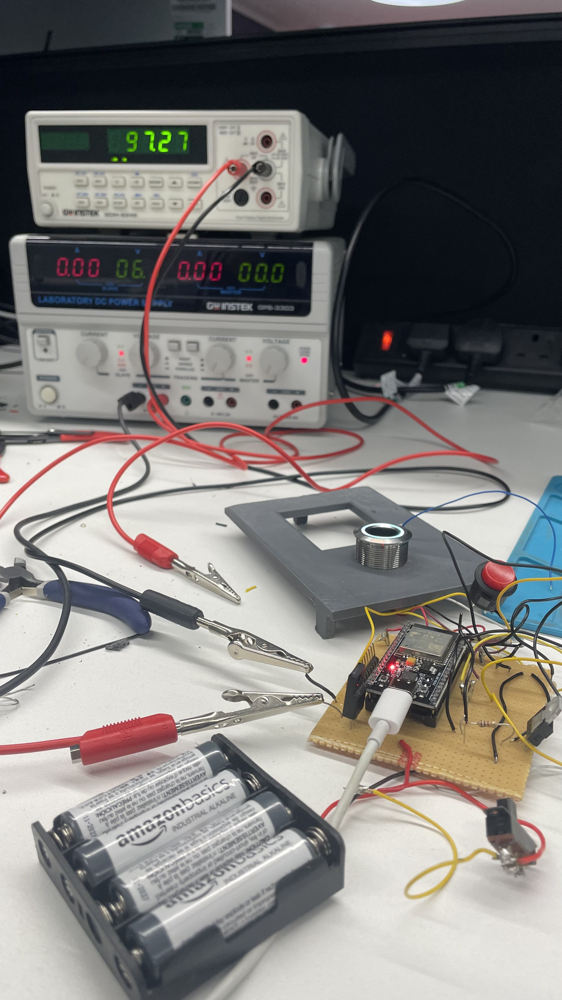

# FingerProjectFYP

Low-cost, low-power IoT smart lock proof of concept that combines fingerprint + passcode authentication, MQTT messaging, and a Flask admin console.




## Project goals
- Deliver a cost-effective smart lock with strong security features.
- Use at least two authentication pillars: what you are (fingerprint) and what you know (passcode).
- Keep power usage low while maintaining reliable operation.

## System overview
ESP32 door unit (fingerprint + keypad) communicates with a Raspberry Pi server over MQTT. The server verifies credentials, logs access, and notifies via SMS/email. A Flask admin console provides HTTPS management of users and passcodes.

```
ESP32 (fingerprint + keypad) -> MQTT (Mosquitto on Raspberry Pi) -> authenticator.py -> SQLite (passcodes.db) -> SMS/Email (Twilio + Gmail SMTP) Admin UI (HTTPS) <-> Flask API <-> SQLite
```

## Repository contents
This repo contains the server and admin console code plus an ESP32 enrollment sketch:
- `ESPcode.ino`: ESP32 fingerprint enrollment and MQTT publishing.
- `authenticator.py`: MQTT verification/registration service + notifications.
- `passcodeServer.py`: Flask API + admin UI server.
- `templates/index.html`, `static/`: Admin console UI.
- `passcodes.db`: SQLite database.

The full project firmware described below includes keypad handling, finite state machine logic, hashing, sleep modes, and encrypted communications.

## Project file layout
```
`-- project/
    |-- ESPcode.ino
    |-- passcodeServer.py
    |-- authenticator.py
    |-- passcodes.db
    |-- cert.pem 
    |-- key.pem 
    `-- flask-app/
        |-- static/
        |   |-- script.js
        |   `-- styles.css
        `-- templates/
            `-- index.html
```

## Hardware
- ESP32 (240 MHz, 32-bit, WiFi/BLE)
- R503 fingerprint sensor (UART, 3.3V, onboard DSP, LED ring)
- 4x3 keypad matrix
- 4x 1.5V AAA batteries + 5V L78 regulator
- Raspberry Pi 3 Model B+
- Physical enclosure: 13.4 cm x 9.3 cm x 3.2 cm

## Firmware (ESP32)
The full device firmware (Arduino/C++) includes:
- Finite state machine with 6 states for scan, passcode input, MQTT comms, and registration.
- SHA-256 passcode hashing on the client.
- Auto sleep after 30 seconds of inactivity and GPIO13 external wake.
- Registration interrupt via button press.
- LED ring color prompts for device state.
- Encrypted communications.

## Server software (Raspberry Pi)
Environment: Raspberry Pi OS Lite 32-bit, headless, managed via SSH.

Services:
- Mosquitto MQTT broker running in the background.
- Authentication service (`authenticator.py`) that:
  - Listens for MQTT messages.
  - Verifies passcodes against SQLite using HMAC + SHA256.
  - Registers new users.
  - Logs access timestamps.
  - Sends SMS and email notifications on successful authentication.

## Admin web console
Hosted on the Pi using Flask with HTTPS (self-signed `cert.pem` and `key.pem`):
- REST API to read/update/delete passcodes (CORS enabled).
- Real-time database view in the frontend.
- Inline editing of hashed passcodes, user names, and timestamps.
- Deletion and refresh actions via the UI.

## Security approach
- Passcodes are hashed with SHA-256 on the device and verified server-side with HMAC + SHA256.
- HTTPS for the admin console.
- MQTT communication encrypted in the full system.
- Basic rate limiting implemented in the firmware.

## Testing
Hardware:
- Power draw measurement with a multimeter in series.
- 8-hour sleep test on battery with wake functionality preserved.

Software:
- Admin console CRUD testing: pass.
- Input validation: SQLite rejects invalid values and returns errors.

Security:
- Hashing verification tests.
- Wireshark inspection (MQTT and HTTPS traffic observed as TCP on non-standard ports).
- Rate limiting: pass.

Known issues:
- Higher-than-expected power draw in sleep mode.
- Wireshark does not clearly display HTTPS/MQTT packets (likely due to ports or capture setup).

## Setup (server + admin console)
1. Configure credentials and endpoints:
   - `ESPcode.ino`: set `ssid`, `password`, `mqtt_server`.
   - `authenticator.py`: set email/Twilio credentials, MQTT broker host/port.
   - `static/script.js`: set `APIlink` to your Flask server URL.
2. Create TLS certs for Flask:
   - `passcodeServer.py` uses `ssl_context=('cert.pem', 'key.pem')`.
3. Install Python dependencies:
   - Example: `pip install flask flask-cors paho-mqtt twilio`

## Running
1. Start Mosquitto.
2. Run the Flask server:
   - `python passcodeServer.py`
3. Run the authenticator service:
   - `python authenticator.py`
4. Flash the ESP32 with `ESPcode.ino` and enroll fingerprints via the serial monitor.

Admin console: `https://<server-ip>:5000/`

## MQTT topics
- Verification:
  - `passcodes/id` (int ID)
  - `passcodes/verify` (passcode string)
  - `passcodes/result` (`true`/`false`)
- Registration:
  - `passcodes/registerPassCode`
  - `passcodes/registerResult`
